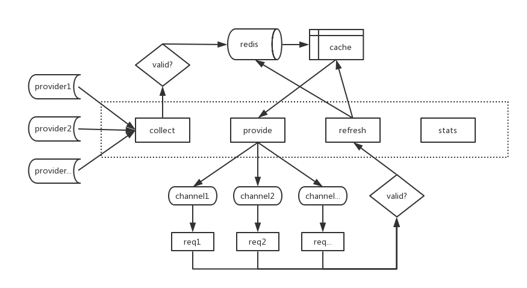

proxy-pool
=========

<b>coding... (ง๑ •̀_•́)ง </b>

proxy-pool, service based on restify.

Collecting some free proxys from the provider's website, save them to redis, and provide proxy for our crawler.

## Flow chart



## Run

```bash
npm start
```

## API

/collect

```json
{

}
```

/provide

```json
{

}
```

/refresh

```json
{

}
```

/stats

```json
{

}
```


## Tests

```bash
no scripts
```

## Contributing

...
